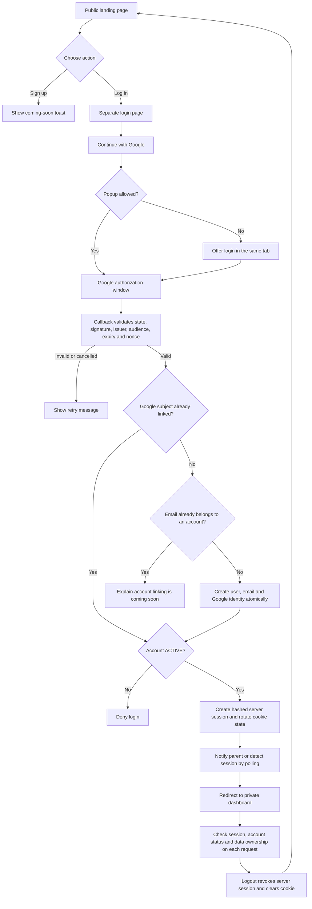
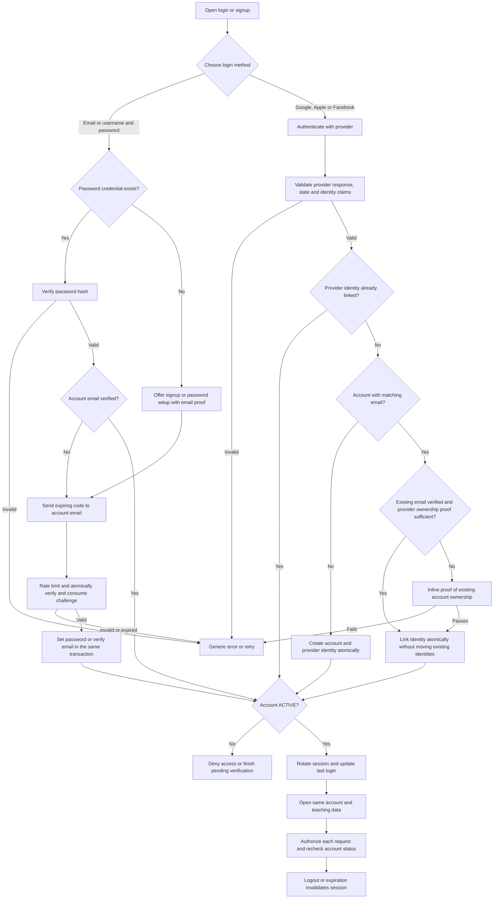

# Classarit

The flow of knowledge. A FastAPI app for independent teachers to manage students,
classes, payments and learning materials.

## Guide

- [Local and IntelliJ setup](#run-locally)
- [Google login setup](#google-login-setup)
- [Current login flow](#current-login-flow)
- [Features and limitations](#features)
- [Architecture and data ownership](#architecture-and-data-ownership)
- [Render deployment](#deploy-on-render)
- [Environment variables](#environment-variables)
- [Authentication database DDL](#authentication-database-ddl)
- [Future login methods](#future-login-methods)
- [Tests](#tests)

## Run locally

```bash
python3 -m venv .venv
source .venv/bin/activate
pip install -r requirements.txt
python run.py --reload
```

Open <http://127.0.0.1:8000>. The landing page is public; `/login` offers Google,
and `/dashboard` requires a valid session. There is no demo bypass.

In IntelliJ, select `.venv/bin/python` as the project interpreter and run the root
`run.py` file. Leave parameters blank for debugging, or use `--reload` for local
reloads. The working directory can be the project root; asset/database paths are
resolved from the source files. Enable the JetBrains Mermaid plugin to render
this README's diagrams in Markdown preview.

## Google login setup

1. Copy [.env.example](.env.example) to `.env` only if you do not already have one.
   Fill in Google and PostgreSQL settings. `.env` is private and ignored by Git.
2. In Google Cloud, configure an OAuth **Web application**, consent screen and any
   test users required while the application is in testing mode. Register the exact
   redirect URI: `http://127.0.0.1:8000/auth/google/callback` for local development.
3. Set `GOOGLE_CLIENT_ID`, `GOOGLE_CLIENT_SECRET`, `GOOGLE_REDIRECT_URI`, and a random
   `SESSION_SECRET_KEY` of at least 32 characters. Use the same hostname consistently;
   the login page redirects to the configured origin to keep OAuth cookies consistent.
4. Initialize a fresh PostgreSQL authentication schema with `setup/auth_schema.sql`.
   If you already installed the earlier five-table design, run only
   `setup/auth_sessions.sql` to add revocable sessions. No destructive migration runs
   automatically on application startup.
5. Start the app, choose **Log in → Continue with Google**, complete Google approval,
   and return to your dashboard. If the popup is blocked, use **Continue in this tab**.

A first successful Google login creates its account automatically. The separate
Signup button only shows a coming-soon toast; no password signup or OTP is enabled.
An existing email belonging to another identity requires a future linking flow and
is not automatically merged in this release.

## Current login flow



The popup sends only a completion notification, never credentials or tokens. The
parent checks the message origin/source and confirms `/auth/me` before navigating.
Polling handles providers that disconnect the popup's opener. Cancelled or failed
login displays a retry option. OAuth tokens are not persisted.

## Features

### Dashboard and Google access

- Public landing page and a separate Google login page.
- Responsive dashboard with sidebar navigation for students, classes, payments, materials, calendar, and settings.
- Summary cards for today's classes, upcoming classes, active students, pending payments, and monthly revenue.
- Today's schedule with student names, subjects, start times, durations, and meeting links.
- New Google accounts start with a private, empty teaching workspace. Legacy demo records remain unassigned.

### Students

- Student cards showing subject, contact email, active status, fee amount, and billing type.
- API support for listing, creating, and updating students.
- Student records include guardian details, phone, class duration, start date, and notes.
- Fee type and amount fields, with Monthly, Per Class, and Package examples in the demo data.

### Classes and attendance

- Class list showing student, subject, date, time, status, and make-up labels.
- Join Class links that open the stored meeting URL.
- API support for listing, creating, and updating classes, including rescheduling through date and time updates.
- Meeting URL validation requiring an `http://` or `https://` prefix.
- Mark Present action and API support for recording or updating attendance.
- Cancel action that records `Teacher Cancelled` as the attendance status; it does not change the class session's status.
- API support for creating a make-up class linked to its original session.
- Class API fields for lesson notes, homework, and practice instructions.

### Payments

- Payment table showing student ID, billing month, amount due, amount paid, status, and payment method.
- API support for creating payment records with payment date and notes.
- Pending balance and current-month revenue calculations on the dashboard.
- Payment records support billing status and payment method fields.

### Learning materials

- Material cards with titles, subjects, descriptions, and file links.
- API uploads with title, description, and subject metadata.
- Supported file extensions: PDF, PNG, JPG, JPEG, MP3, WAV, DOCX, and TXT.
- Local file storage and serving under `/uploads`.

### Settings, storage, and API tools

- Read-only profile showing the logged-in user name/email and teacher timezone.
- Persistent SQLite storage in `classarit.db` using SQLAlchemy.
- Project-relative paths for the database, templates, static assets, and uploads.
- Interactive API documentation at `/docs`, alternative documentation at `/redoc`, and the OpenAPI schema at `/openapi.json`.

### Current MVP limitations

- Signup shows a coming-soon toast. Password login, OTP, Apple/Facebook and account linking are not implemented.
- Add Student and Schedule Class dialogs are placeholders; create and edit records through the API.
- The Reschedule button and Add Notes workflow are not implemented in the UI.
- Calendar is a placeholder; scheduled sessions are available in the Classes section.
- Payment creation, material uploads, and make-up scheduling are available through the API, without UI forms.
- Settings are display-only. Repeat type is stored on classes, but recurring sessions are not generated automatically.
- Assignment and material-assignment models exist, but have no exposed management UI or API.
- Old demo materials contain sample file paths; sample files are not bundled or shared with new accounts.


## Architecture and data ownership

| Module | Responsibility |
| --- | --- |
| `run.py` | Local/Render Uvicorn startup; Render host, port and proxy handling |
| `app/main.py` | Application composition, middleware, lifecycle and protected file serving |
| `app/routes/public.py` | Public landing and health routes |
| `app/auth/routes.py` | Login page, Google start/callback, login status and logout |
| `app/auth/settings.py` | OAuth configuration and cookie policy |
| `app/auth/database.py` | Lazy PostgreSQL connection from DB variables |
| `app/auth/repository.py` | Google identity resolution, users and revocable sessions |
| `app/auth/dependencies.py` | Session/status checks and CSRF validation |
| `app/routes/dashboard.py`, `app/routes/teaching.py` | Private dashboard and teaching APIs |
| `app/services/ownership.py` | Map authenticated UUIDs to private teacher workspaces |
| `app/services/serializers.py` | API response serialization |
| `app/models.py`, `app/database.py` | Existing SQLAlchemy teaching data in SQLite |
| `app/config.py` | Load `.env`; select local/persistent data paths |
| `app/templates/`, `app/static/` | Separate landing/login/callback/dashboard UI, CSS and JavaScript |

Authentication uses PostgreSQL (`classarit` schema); teaching data and uploads still
use SQLite/local disk. An account UUID maps to `teachers.auth_user_id`. Student,
class, payment and material operations are scoped to that teacher. Requests cannot
choose another teacher by sending a different `teacher_id`. Uploads require ownership
and are no longer served through an unrestricted static mount.

Startup adds the ownership columns/index to existing local teaching tables when
needed. Existing records are preserved but never assigned to a new Google account.
New accounts see an empty dashboard. Assigning old demo records would require an
explicit migration. The legacy seed code is retained for reference and is not run.

Session cookies are HttpOnly and SameSite=Lax, with Secure enabled for HTTPS/Render.
The browser holds an opaque session token inside a signed cookie; PostgreSQL stores
only its SHA-256 hash and expiry (12 hours). Every protected request rechecks ACTIVE
status. Logout deletes the server session, so replaying an old cookie cannot log in.
Teaching API mutations require `X-CSRF-Token` from the dashboard's `csrf-token` meta
field. Logout uses a hidden form token. Protected responses have `Cache-Control: no-store`.

## Deploy on Render

Push changes to the connected branch, then create a Blueprint from `render.yaml`
or configure an existing service with:

| Setting | Value |
| --- | --- |
| Runtime | Python 3 |
| Root directory | Blank (repository root) |
| Build | `python -m pip install -r requirements.txt` |
| Start | `python run.py` |
| Python version | `PYTHON_VERSION=3.13.5` |
| Health path | `/health` |
| Data directory | `CLASSARIT_DATA_DIR=/var/data` |
| Persistent disk | `/var/data`, 1 GB, paid instance |

Set Google, DB and session variables in Render's Environment settings. Register
`https://YOUR-SERVICE.onrender.com/auth/google/callback` in Google Cloud and use that
exact `GOOGLE_REDIRECT_URI`. Render requires an HTTPS callback and a session secret.
Its proxy headers are trusted by the launcher only when `RENDER=true`; do not set
that flag locally. PostgreSQL must be initialized before login can succeed.

The Blueprint uses paid persistent storage for teaching data and uploads. PostgreSQL
accounts/sessions persist separately. For a disposable Free Web Service, omit the
disk and use `CLASSARIT_DATA_DIR=/tmp/classarit`; teaching records/uploads will be
lost on restarts. See [Render persistent disks](https://render.com/docs/disks).

## Environment variables

`python-dotenv` loads `.env` without overriding actual environment variables. No
credential belongs in `.env.example`, source files or the README.

| Variables | Purpose |
| --- | --- |
| `GOOGLE_CLIENT_ID`, `GOOGLE_CLIENT_SECRET` | Google OAuth credentials |
| `GOOGLE_REDIRECT_URI` | Exact absolute callback ending in `/auth/google/callback` |
| `DB_HOST`, `DB_PORT`, `DB_NAME`, `DB_USER`, `DB_PASSWORD` | PostgreSQL credentials; distinct from the SQLite teaching database |
| `DB_SCHEMA` | Authentication schema, default `classarit` |
| `DB_SSLMODE` | PostgreSQL TLS policy; use `require` or the provider's stricter recommendation for hosted databases |
| `SESSION_SECRET_KEY` | Stable random signing secret, minimum 32 characters |
| `CLASSARIT_DATA_DIR` | SQLite/uploads directory; defaults to the project root |
| `RESEND_API_KEY`, `RESEND_FROM_EMAIL` | Reserved for future OTP sending; not used yet |
| `OTP_HMAC_SECRET` | Reserved for future OTP hashing; separate from the session secret |

Resend uses an API key, not a client ID. No email is sent by this release.
Missing Google settings leave the landing page available with login disabled.
A database/provider failure shows a generic login error without exposing secrets.

## Authentication database DDL

[setup/auth_schema.sql](setup/auth_schema.sql) is the canonical **fresh-install** DDL
for PostgreSQL 14+. It creates the `classarit` schema and all six tables:

| Table | Purpose |
| --- | --- |
| `app_users` | Shared profile, optional future username, currency, status, timestamps |
| `user_emails` | Unique contact emails, verification date and primary-email flag |
| `auth_identities` | Unique provider/subject identities linked to users |
| `auth_sessions` | Hashed, expiring, revocable sessions (implemented) |
| `password_credentials` | Reserved for password login |
| `auth_challenges` | Reserved for email verification, password setup/reset and linking |

`citext` is installed before tables. If already installed in `public` or another
schema, the script reuses its type/operators through a transaction-local search path;
it never relocates a shared extension. Application tables and trigger functions
remain in `classarit`. `classarit.set_updated_at()` is created before its triggers.
PostgreSQL 14+ includes `gen_random_uuid()`. The installation role needs privileges
for creating schemas/tables/functions and, if absent, the extension.

The script fails if `classarit.app_users` already exists. Do not drop an existing
account database to apply it. For the previous five-table schema use the additive
[auth_sessions.sql](setup/auth_sessions.sql). Legacy Authoryn's single-table schema
requires a separate data migration preserving UUIDs and business foreign keys.

```bash
# Supply the connection string securely through your shell environment.
psql "$DATABASE_URL" -v ON_ERROR_STOP=1 -f setup/auth_schema.sql
# Existing five-table installation only:
psql "$DATABASE_URL" -v ON_ERROR_STOP=1 -f setup/auth_sessions.sql
```

For a non-default `DB_SCHEMA`, adapt the SQL schema qualifiers before applying it.
The checked-in installation scripts target `classarit`.

<details>
<summary>Complete fresh-install authentication DDL</summary>

```sql
-- PostgreSQL 14+; fresh installation only, not an existing app_users migration.
-- Execute with psql -v ON_ERROR_STOP=1 -f setup/auth_schema.sql.
BEGIN;
CREATE SCHEMA IF NOT EXISTS classarit;
CREATE EXTENSION IF NOT EXISTS citext WITH SCHEMA classarit;
-- Reuse an existing shared citext installation without relocating it.
DO $$
DECLARE extension_schema text;
BEGIN
    SELECT n.nspname INTO extension_schema FROM pg_extension e
    JOIN pg_namespace n ON n.oid=e.extnamespace WHERE e.extname='citext';
    PERFORM set_config('search_path', format('classarit,%I,pg_catalog', extension_schema), true);
END;
$$;

-- Fail before changes if a legacy account table already exists.
DO $$
BEGIN
    IF to_regclass('classarit.app_users') IS NOT NULL THEN
        RAISE EXCEPTION 'app_users already exists; use a reviewed data migration, not this fresh-install DDL';
    END IF;
END;
$$;

-- Created before the triggers that depend on it.
CREATE OR REPLACE FUNCTION classarit.set_updated_at()
RETURNS trigger LANGUAGE plpgsql AS $$
BEGIN
    NEW.updated_at = CURRENT_TIMESTAMP;
    RETURN NEW;
END;
$$;

CREATE TABLE classarit.app_users (
    id uuid PRIMARY KEY DEFAULT gen_random_uuid(),
    username citext UNIQUE,
    full_name text,
    avatar_url text,
    base_currency varchar(3) NOT NULL DEFAULT 'USD'
        CHECK (base_currency ~ '^[A-Z]{3}$'),
    status varchar(30) NOT NULL DEFAULT 'PENDING'
        CHECK (status IN ('PENDING', 'ACTIVE', 'BLOCKED', 'INACTIVE')),
    last_login_at timestamptz,
    created_at timestamptz NOT NULL DEFAULT CURRENT_TIMESTAMP,
    updated_at timestamptz NOT NULL DEFAULT CURRENT_TIMESTAMP,
    CHECK (username IS NULL OR username::text ~ '^[A-Za-z0-9_]{3,50}$')
);

CREATE TABLE classarit.user_emails (
    id uuid PRIMARY KEY DEFAULT gen_random_uuid(),
    app_user_id uuid NOT NULL REFERENCES classarit.app_users(id) ON DELETE CASCADE,
    email citext NOT NULL UNIQUE,
    verified_at timestamptz,
    is_primary boolean NOT NULL DEFAULT false,
    created_at timestamptz NOT NULL DEFAULT CURRENT_TIMESTAMP,
    updated_at timestamptz NOT NULL DEFAULT CURRENT_TIMESTAMP,
    CHECK (email::text = btrim(email::text) AND length(email::text) > 0)
);
CREATE INDEX idx_user_emails_user ON classarit.user_emails(app_user_id);
CREATE UNIQUE INDEX uq_user_primary_email ON classarit.user_emails(app_user_id)
    WHERE is_primary;

CREATE TABLE classarit.auth_identities (
    id uuid PRIMARY KEY DEFAULT gen_random_uuid(),
    app_user_id uuid NOT NULL REFERENCES classarit.app_users(id) ON DELETE CASCADE,
    provider text NOT NULL CHECK (provider IN ('GOOGLE', 'APPLE', 'FACEBOOK')),
    provider_subject text NOT NULL CHECK (length(btrim(provider_subject)) > 0),
    provider_email citext,
    provider_email_verified boolean NOT NULL DEFAULT false,
    created_at timestamptz NOT NULL DEFAULT CURRENT_TIMESTAMP,
    updated_at timestamptz NOT NULL DEFAULT CURRENT_TIMESTAMP,
    CONSTRAINT uq_provider_subject UNIQUE (provider, provider_subject)
);
CREATE INDEX idx_auth_identities_user ON classarit.auth_identities(app_user_id);

CREATE TABLE classarit.password_credentials (
    app_user_id uuid PRIMARY KEY REFERENCES classarit.app_users(id) ON DELETE CASCADE,
    password_hash text NOT NULL CHECK (length(btrim(password_hash)) > 0),
    password_changed_at timestamptz NOT NULL DEFAULT CURRENT_TIMESTAMP,
    created_at timestamptz NOT NULL DEFAULT CURRENT_TIMESTAMP,
    updated_at timestamptz NOT NULL DEFAULT CURRENT_TIMESTAMP
);

CREATE TABLE classarit.auth_challenges (
    id uuid PRIMARY KEY DEFAULT gen_random_uuid(),
    app_user_id uuid NOT NULL REFERENCES classarit.app_users(id) ON DELETE CASCADE,
    target_email citext NOT NULL,
    purpose text NOT NULL CHECK (purpose IN
        ('EMAIL_VERIFY', 'PASSWORD_SETUP', 'PASSWORD_RESET', 'LINK_IDENTITY')),
    -- Keyed HMAC of a random code/token, challenge ID, purpose and target.
    -- The HMAC key belongs in server secrets, never in this database.
    secret_digest text NOT NULL CHECK (length(btrim(secret_digest)) > 0),
    -- Bind linking proof to the provider identity validated by the backend.
    pending_provider text CHECK (pending_provider IN ('GOOGLE', 'APPLE', 'FACEBOOK')),
    pending_subject text,
    expires_at timestamptz NOT NULL,
    consumed_at timestamptz,
    attempt_count integer NOT NULL DEFAULT 0,
    max_attempts integer NOT NULL DEFAULT 5,
    created_at timestamptz NOT NULL DEFAULT CURRENT_TIMESTAMP,
    CHECK (expires_at > created_at),
    CHECK (attempt_count >= 0 AND max_attempts > 0 AND attempt_count <= max_attempts),
    CHECK (
        (purpose = 'LINK_IDENTITY' AND pending_provider IS NOT NULL
         AND pending_subject IS NOT NULL AND length(btrim(pending_subject)) > 0)
        OR (purpose <> 'LINK_IDENTITY' AND pending_provider IS NULL AND pending_subject IS NULL)
    )
);
CREATE INDEX idx_auth_challenges_user ON classarit.auth_challenges(app_user_id);
CREATE INDEX idx_auth_challenges_expiry ON classarit.auth_challenges(expires_at)
    WHERE consumed_at IS NULL;

CREATE TRIGGER trg_app_users_updated_at BEFORE UPDATE ON classarit.app_users
    FOR EACH ROW EXECUTE FUNCTION classarit.set_updated_at();
CREATE TRIGGER trg_user_emails_updated_at BEFORE UPDATE ON classarit.user_emails
    FOR EACH ROW EXECUTE FUNCTION classarit.set_updated_at();
CREATE TRIGGER trg_auth_identities_updated_at BEFORE UPDATE ON classarit.auth_identities
    FOR EACH ROW EXECUTE FUNCTION classarit.set_updated_at();
CREATE TRIGGER trg_password_credentials_updated_at BEFORE UPDATE ON classarit.password_credentials
    FOR EACH ROW EXECUTE FUNCTION classarit.set_updated_at();
CREATE TABLE IF NOT EXISTS classarit.auth_sessions (
    token_hash text PRIMARY KEY,
    app_user_id uuid NOT NULL REFERENCES classarit.app_users(id) ON DELETE CASCADE,
    expires_at timestamptz NOT NULL,
    created_at timestamptz NOT NULL DEFAULT CURRENT_TIMESTAMP
);
CREATE INDEX IF NOT EXISTS idx_auth_sessions_user ON classarit.auth_sessions(app_user_id);
CREATE INDEX IF NOT EXISTS idx_auth_sessions_expiry ON classarit.auth_sessions(expires_at);
COMMIT;
```

</details>

### Optional destructive teardown

[setup/auth_teardown.sql](setup/auth_teardown.sql) removes the six authentication
tables and their rows, indexes and triggers. It preserves the schema, shared function
and extension. It uses a transaction and RESTRICT, so dependencies from business
tables stop the operation rather than cascading into unrelated data. Review and
back up the target database before running it. It is never run by the application.

## Future login methods

Signup currently shows only a toast. Password signup/setup/reset, Resend OTP,
Apple/Facebook and multi-provider linking remain future work. The database supports
their identities; routes and proof flows still need implementation.

The longer-term experience is one user account with several login methods. Never
silently attach a provider or password because its email matches an existing account.
Automatic linking needs sufficient provider proof and a verified existing account;
otherwise require an inline ownership challenge. A Google-first user needs verified
password setup before password login can work. Apple relay addresses may require
explicit linking from an authenticated account. Google's `email_verified` alone is
not sufficient ownership proof for every third-party email. See
[Google identity claims](https://developers.google.com/identity/gsi/web/reference/html-reference).

Before enabling those methods: use Argon2id hashes; bind OTP HMACs to purpose, account,
email and pending identity; enforce issuance/attempt limits; atomically consume proofs;
never return OTPs in API responses; preserve BLOCKED/INACTIVE status; and prevent an
unverified password signup from leaving an attacker-chosen password on a later social
account. These are application rules, not guarantees provided by DDL alone.

<details>
<summary>Future multi-method login flow (not implemented)</summary>



</details>

## Tests

The integration suite launches a temporary PostgreSQL cluster and uses temporary
SQLite storage. It never connects to the database in `.env`. Install PostgreSQL tools
(`initdb`, `pg_ctl`, `psql`) locally, then run:

```bash
.venv/bin/python -B -m unittest discover -s tests -v
```

Coverage includes public access, demo-bypass removal, OAuth state/nonce and signed-token
validation, first/repeat Google login, email conflicts, blocked/expired sessions,
logout cookie replay, CSRF protection and cross-account data/file isolation.
Google responses are mocked or locally signed for tests; a real Google consent flow
requires the configured OAuth client and a user completing Google's login screen.
