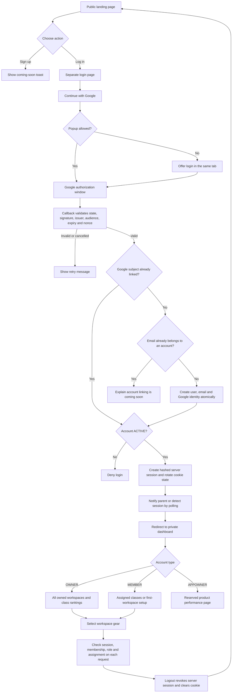
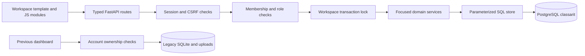
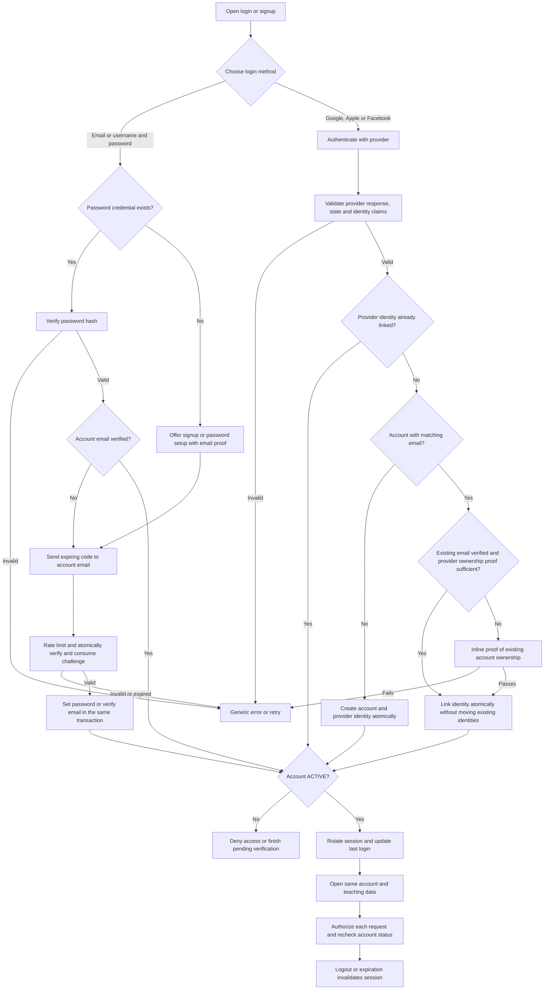
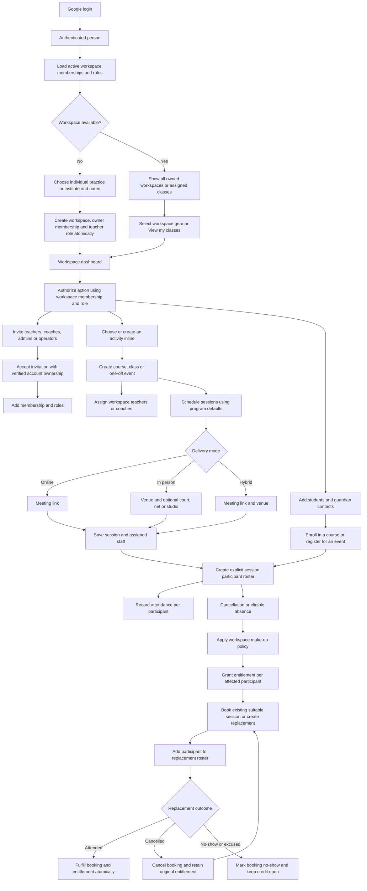
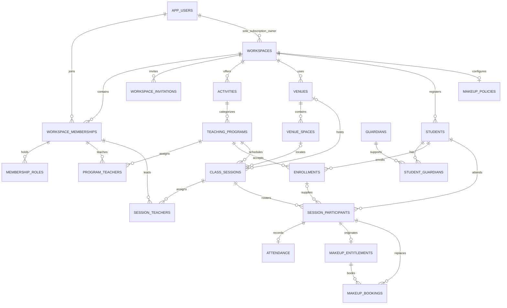
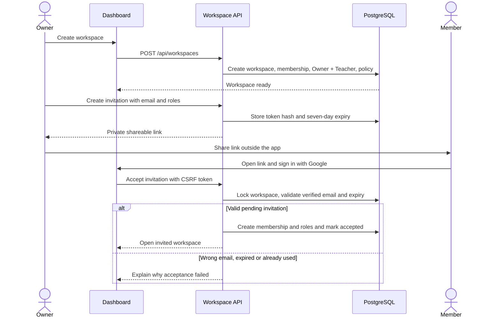
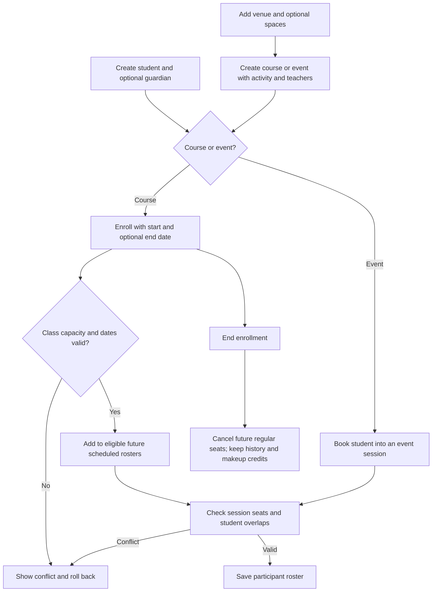
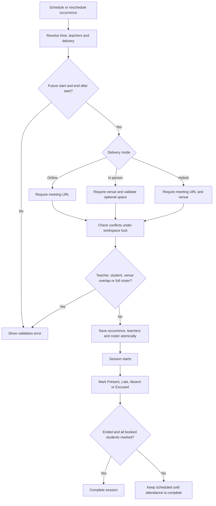
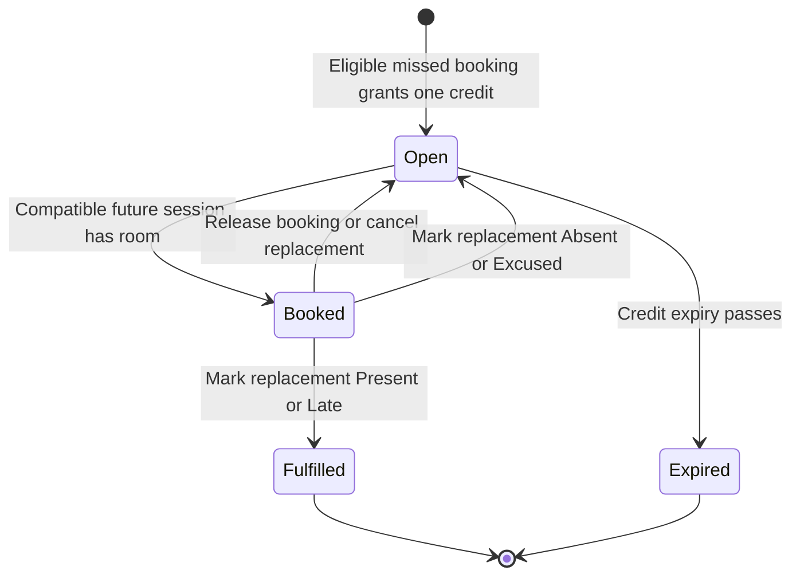
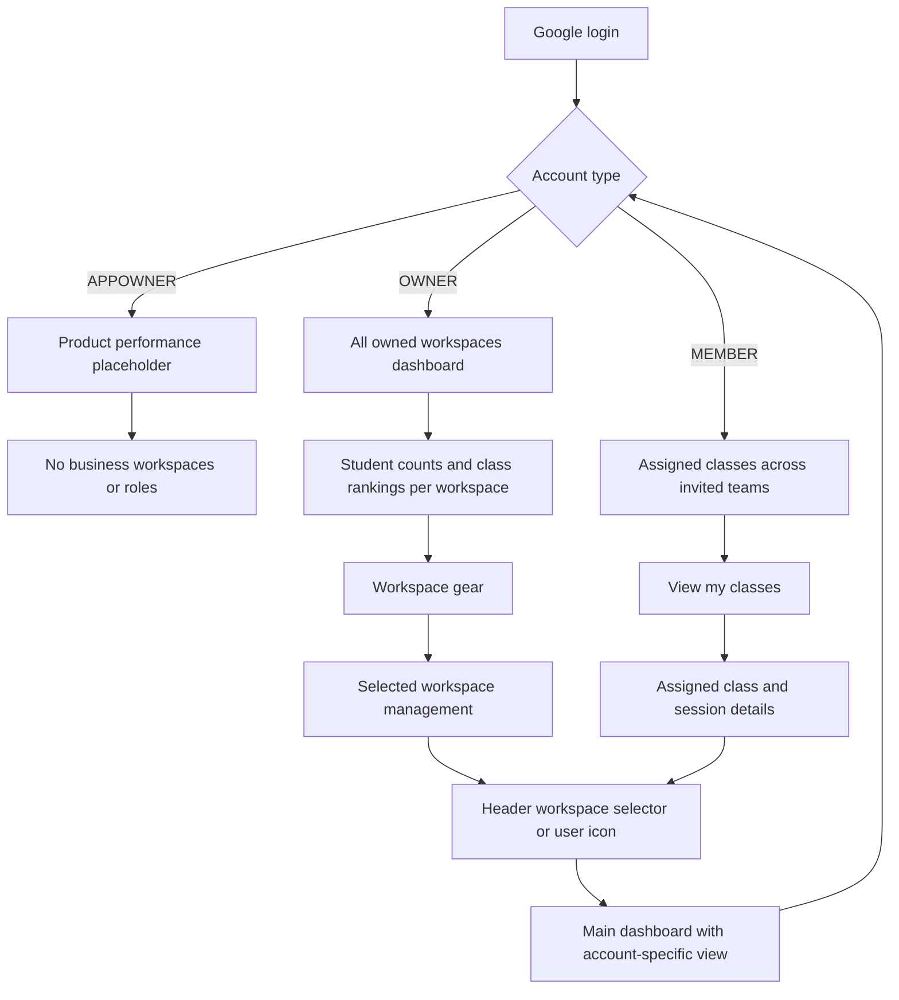

# Classarit

The flow of knowledge. A FastAPI app for independent teachers and institutes to manage
teams, students, classes, sports events, attendance and makeup lessons.

## Guide

- [Local and IntelliJ setup](#run-locally)
- [Google login setup](#google-login-setup)
- [Current login flow](#current-login-flow)
- [Features and limitations](#features)
- [Architecture and data ownership](#architecture-and-data-ownership)
- [Render deployment](#deploy-on-render)
- [Environment variables](#environment-variables)
- [Authentication database DDL](#authentication-database-ddl)
- [Future login methods](#future-login-methods)
- [Owner dashboard and account types](#owner-dashboard-and-account-types)
- [Workspace and teaching data flow](#workspace-and-teaching-data-flow)
- [UI walkthrough and API reference](#ui-walkthrough-and-api-reference)
- [Progressive implementation plan](#progressive-implementation-plan)
- [Tests](#tests)

## Run locally

```bash
python3 -m venv .venv
source .venv/bin/activate
pip install -r requirements.txt
python run.py --reload
```

Open <http://127.0.0.1:8000>. The landing page is public; `/login` offers Google,
and `/dashboard` requires a valid session. There is no demo bypass. On a fresh
installation, configure `.env`, initialize [authentication DDL](#authentication-database-ddl),
then run migrations `001_workspaces_and_teaching.sql`,
`002_account_types_and_single_owner.sql`, `003_owner_staff_separation.sql`, `004_recurring_session_series.sql`, `005_workspace_type_role_policy.sql` and `006_direct_scheduled_participants.sql` in order with
`python setup/apply_migration.py FILENAME` before opening the signed-in dashboard. Existing configured databases with the journaled
migration skip safely.

Two shared IntelliJ Python run configurations are saved in `.run/`, outside the
ignored `.idea/` directory:

- **Classarit Local** — normal Run or Debug, with breakpoints and no reloader.
- **Classarit Local Reload** — Run with automatic reload after Python changes.

Open the project root in IntelliJ, then choose one from the top-right run configuration
selector and click Run (or Debug for **Classarit Local**). Both use
`$PROJECT_DIR$/.venv/bin/python`, execute the root `run.py`, and set the working
directory to the project root. They explicitly use `RENDER=false` and `PORT=8000`.
The app loads credentials from the existing `.env`; no credentials are stored in the
run configurations. Run only one configuration at a time to avoid a port conflict.

If they do not appear, ensure IntelliJ's Python plugin is enabled and reopen the
project. Under **Run → Edit Configurations**, select **Classarit Local** and confirm
its Python interpreter points to your project's `.venv/bin/python`. If the virtual
environment is missing, run the setup commands above first. The saved project SDK
may still refer to Python 3.10; these configurations explicitly use the project's
virtual environment instead.

The terminal equivalent is `.venv/bin/python run.py` (add `--reload` for reloads).
Enable the JetBrains Mermaid plugin to render this README's diagrams in Markdown preview.

## Google login setup

1. Copy [.env.example](.env.example) to `.env` only if you do not already have one.
   Fill in Google and PostgreSQL settings. `.env` is private and ignored by Git.
2. In Google Cloud, configure an OAuth **Web application**, consent screen and any
   test users required while the application is in testing mode. Register the exact
   redirect URI: `http://127.0.0.1:8000/auth/google/callback` for local development.
3. Set `GOOGLE_CLIENT_ID` and `GOOGLE_CLIENT_SECRET`. The callback is built from the
   current request origin plus `/auth/google/callback`; no redirect environment variable
   is used. Stay on the same hostname throughout login. The signing key is generated
   and saved automatically unless an optional `SESSION_SECRET_KEY` is supplied.
4. Initialize a fresh PostgreSQL authentication schema with `setup/auth_schema.sql`.
   If you already installed the earlier five-table design, run only
   `setup/auth_sessions.sql` to add revocable sessions. No destructive migration runs
   automatically on application startup.
5. Start the app, choose **Log in → Continue with Google**, complete Google approval,
   and return to your dashboard. If the popup is blocked, use **Continue in this tab**.

A first successful Google login creates its account automatically. The separate
Signup button only shows a coming-soon toast; no password signup or OTP is enabled.
An existing email belonging to another identity requires a future linking flow and
is not automatically merged in this release.

## Current login flow



The popup sends only a completion notification, never credentials or tokens. The
parent checks the message origin/source and confirms `/auth/me` before navigating.
Polling handles providers that disconnect the popup's opener. Cancelled or failed
login displays a retry option. OAuth tokens are not persisted.

## Features

### Workspace dashboard

- Google login opens an account dashboard. An OWNER sees all owned workspaces,
  current student rankings and class usage over the last 30 days.
- Each owned workspace has a gear beside its title to manage it. Workspace details open only after
  explicit selection. Switch workspace and the top-left user icon return to the main dashboard.
- Invited teachers see only assigned classes and their schedule/attendance. First-time
  users without memberships can create a workspace, becoming its single OWNER.
- Workspace-level Calendar is the default workspace tab. Reporting is owner-only and holds metric cards for students, classes, upcoming sessions and active teachers.
- The existing navy/blue style continues in a responsive dashboard with real forms.

### Team and teaching setup

- Invite teachers, coaches, admins and operators with an expiring shareable link.
  Acceptance requires the invited verified Google email. Revoke invitations and
  manage member roles/status; the final active owner cannot be removed.
- Create academic, arts, sports or other activities inline when creating a program.
- Create group or one-to-one courses and one-off events. Assign default teachers,
  duration, capacity, level and online/in-person/hybrid delivery details.
- Add venues, addresses, directions and rooms/courts/pitches.
- Add/edit students and their primary guardian contact; enroll students in courses
  or book them directly into event sessions. End enrollment to release future seats.

### Scheduling, attendance and makeup classes

- Schedule one occurrence or generate a weekly repeat by selecting multiple weekdays
  and a repeat duration in months. The schedule form can select students directly;
  active eligible enrollments also populate every created roster. Enrolling later
  still populates already-scheduled future sessions.
- Reschedule future sessions, cancel with an explanation, join online meetings,
  open venue directions, mark attendance and complete finished sessions.
- Reject teacher, student and venue/space overlaps and full classes/sessions.
- Cancellation can grant credits to the original roster in one transaction.
  Staff can grant individual absence credits or approved policy exceptions.
- Book a compatible replacement, release/rebook it, and fulfill the credit when
  attendance is Present or Late. Replacement cancellation preserves the original credit.
- Teacher-only members see their assigned teaching records and relevant students;
  management actions remain restricted by backend role checks.

### Dynamic workspace screens

The previous dashboard and its static UI assets have been removed; `/legacy/dashboard`
returns 404. Existing SQLite records are retained for a future migration, and its
older data APIs remain separate from the PostgreSQL workspace UI.

Workspace details use compact icons with accessible names and hover labels. Quick Add
lives in the workspace header for Student, Class / event and Schedule actions. The
Switch workspace dropdown sits at the top right and lists the signed-in user's active
workspace memberships by name. Selecting an option opens that workspace; backend access
checks still apply. The profile icon returns to the main account dashboard. Mobile
layouts retain 44px action targets and a readable native selector. Save, update,
delete and other data-changing actions show a blur-backed saving overlay until the
backend operation and follow-up refresh finish.

### Current MVP limitations

- Signup still shows the coming-soon notice. Password/OTP, Apple/Facebook and account
  linking remain future work, as requested.
- Invitations are shareable links; the app does not send email invitations yet.
- Schedule is an occurrence list, not a drag-and-drop calendar. Weekly recurrence
  generation is available; bulk edit/cancel for a whole series is still future work.
- Program teacher edits change defaults for new sessions; existing session assignments
  remain historical snapshots. UI scheduling inherits defaults; the API also accepts
  per-session teacher, delivery and capacity overrides.
- Workspace closure, class/venue deletion, student self-service and attendance
  correction after a settled makeup require later workflows.
- Students have optional primary guardian entry/edit in the UI; multiple-guardian
  management is reserved by the schema. Clearing a guardian name does not delete history.
- A nonzero absence notice requirement needs staff review. Owner/Admin can grant an
  `OTHER` exception with a note. No-show/Excused replacement attendance leaves the
  credit open for another future session; no automatic financial penalty is applied.
- Billing/materials migration, reminders, audit logs, database RLS, pagination and
  branch administration remain future phases. Makeup fee inclusion is metadata,
  not payment collection. Workspace writes currently serialize per workspace.


## Architecture and data ownership

| Module | Responsibility |
| --- | --- |
| `run.py` | Local/Render Uvicorn startup; Render host, port and proxy handling |
| `app/main.py` | Application composition, middleware, lifecycle and protected file serving |
| `app/routes/public.py` | Public landing and health routes |
| `app/auth/routes.py` | Login page, Google start/callback, login status and logout |
| `app/auth/settings.py` | OAuth configuration and cookie policy |
| `app/auth/database.py` | Lazy PostgreSQL connection from DB variables |
| `app/auth/repository.py` | Google identity resolution, users and revocable sessions |
| `app/auth/dependencies.py` | Session/status checks and CSRF validation |
| `app/routes/dashboard.py` | Account dashboard, explicit workspace selection, onboarding and invitation pages |
| `app/workspaces/services/overview.py` | Owner-only aggregates and assigned-class account projection |
| `app/templates/account_dashboard.html`, `app/static/account-dashboard.*` | Portfolio cards, rankings, staff landing and shared account navigation |
| `app/workspaces/routes/` | Typed HTTP endpoints for organizations, catalog and sessions |
| `app/workspaces/schemas.py` | Validated request payloads |
| `app/workspaces/access.py` | Active membership, roles, assignments and workspace write lock |
| `app/workspaces/db.py` | Transaction boundary and parameterized SQL helpers |
| `app/workspaces/services/organizations.py` | Workspace creation, invitations and member roles |
| `app/workspaces/services/catalog.py` | Activities, venues, programs, students and enrollment |
| `app/workspaces/services/scheduling.py` | Timezones, overlap checks, rosters and attendance |
| `app/workspaces/services/makeups.py` | Policy, credits, booking, cancellation and release |
| `app/workspaces/services/queries.py` | Permission-filtered dashboard projection |
| `app/static/workspaces/` | Separate API, forms, actions, rendering and startup JS modules |
| `setup/apply_migration.py` | Atomic versioned migration with checksum journal |
| `app/routes/teaching.py` | Retained SQLite data APIs; previous dashboard removed |
| `app/services/ownership.py` | Map authenticated UUIDs to private teacher workspaces |
| `app/services/serializers.py` | API response serialization |
| `app/models.py`, `app/database.py` | Existing SQLAlchemy teaching data in SQLite |
| `app/config.py` | Load `.env`; select local/persistent data paths |
| `app/templates/`, `app/static/` | Separate landing/login/callback/dashboard UI, CSS and JavaScript |

Authentication and the new workspace teaching model use PostgreSQL in `classarit`.
All business relationships are qualified by `workspace_id`. Authorization checks an
active account, active membership, role and relevant teacher assignment. Mutations
lock the workspace row before checking capacity/conflicts and commit all changes
atomically. Composite foreign keys prevent cross-workspace relationships even if a
caller supplies another workspace's UUID. The selector itself grants no permission.

SQLite and local uploads remain only for the previous dashboard. Its
`teachers.auth_user_id` mapping and ownership checks continue to protect old records.
The local preflight found unassigned demo teaching records and no owned student
records to migrate. They were preserved. A Render disk may contain different legacy
data: inventory that separately before any future billing/materials migration.
Startup still initializes legacy SQLite storage, but never runs the new PostgreSQL DDL.



Session cookies are HttpOnly and SameSite=Lax, with Secure enabled for HTTPS/Render.
The browser holds an opaque session token inside a signed cookie; PostgreSQL stores
only its SHA-256 hash and expiry (12 hours). Every protected request rechecks ACTIVE
status. Logout deletes the server session, so replaying an old cookie cannot log in.
Teaching API mutations require `X-CSRF-Token` from the dashboard's `csrf-token` meta
field. Logout uses a hidden form token. Protected responses have `Cache-Control: no-store, no-cache, must-revalidate, max-age=0`; workspace fetch calls also use `cache: "no-store"`.

## Deploy on Render

Push changes to the connected branch, then create a Blueprint from `render.yaml`
or configure an existing service with:

| Setting | Value |
| --- | --- |
| Runtime | Python 3 |
| Root directory | Blank (repository root) |
| Build | `python -m pip install -r requirements.txt` |
| Start | `python run.py` |
| Python version | `PYTHON_VERSION=3.13.5` |
| Health path | `/health` |
| Data directory | `CLASSARIT_DATA_DIR=/var/data` |
| Persistent disk | `/var/data`, 1 GB, paid instance |

Set Google and DB credentials in Render's Environment settings. Register
`https://YOUR-SERVICE.onrender.com/auth/google/callback` in Google Cloud and use that
HTTPS callback in Google Cloud. No callback or session-secret environment variable
is required. The request host and trusted proxy scheme determine the callback.
Proxy headers are trusted by the launcher only when `RENDER=true`; do not set
that flag locally. PostgreSQL must be initialized before login can succeed.

Apply the authentication schema on a fresh database (the baseline auth DDL gains
`user_type` through migration 002), then apply all workspace
migrations in order before releasing this dashboard:

```bash
python setup/apply_migration.py 001_workspaces_and_teaching.sql
python setup/apply_migration.py 002_account_types_and_single_owner.sql
python setup/apply_migration.py 003_owner_staff_separation.sql
python setup/apply_migration.py 004_recurring_session_series.sql
python setup/apply_migration.py 005_workspace_type_role_policy.sql
python setup/apply_migration.py 006_direct_scheduled_participants.sql
```

Run against the intended DB credentials from `.env` locally or Render Environment.
The configured project database needs migrations through 006. If Render uses that same
database, do not manually rerun the SQL: the runner safely verifies/skips its journaled
version. A different Render database needs its own initialization. No DDL runs on startup.

The Blueprint uses paid persistent storage for legacy SQLite, uploads and the generated
session signing key. PostgreSQL accounts, workspaces and teaching records persist
separately. With a disposable disk and `CLASSARIT_DATA_DIR=/tmp/classarit`, legacy
records/uploads and the generated signing key are lost on restart; users must sign
in again. PostgreSQL workspace records remain intact. See [Render persistent disks](https://render.com/docs/disks).

## Environment variables

`python-dotenv` loads `.env` without overriding actual environment variables. No
credential belongs in `.env.example`, source files or the README.

| Variables | Purpose |
| --- | --- |
| `GOOGLE_CLIENT_ID`, `GOOGLE_CLIENT_SECRET` | Google OAuth credentials |
| `DB_HOST`, `DB_PORT`, `DB_NAME`, `DB_USER`, `DB_PASSWORD` | PostgreSQL credentials; distinct from the SQLite teaching database |
| `DB_SCHEMA` | Authentication schema, default `classarit` |
| `DB_SSLMODE` | PostgreSQL TLS policy; use `require` or the provider's stricter recommendation for hosted databases |
| `SESSION_SECRET_KEY` | Optional shared signing key (minimum 32 characters when supplied); otherwise generated automatically |
| `CLASSARIT_DATA_DIR` | SQLite/uploads directory; defaults to the project root |
| `RESEND_API_KEY`, `RESEND_FROM_EMAIL` | Reserved for future OTP sending; not used yet |
| `OTP_HMAC_SECRET` | Reserved for future OTP hashing; separate from the session secret |

Resend uses an API key, not a client ID. No email is sent by this release.
Missing Google settings leave the landing page available with login disabled.
A database/provider failure shows a generic login error without exposing secrets.


### Automatic callback and session signing

The app uses `request.url_for("google_callback")`, so the browser's origin determines
its callback:

- Local: `http://127.0.0.1:8000/auth/google/callback`.
- Remote: `https://myremote.example.com/auth/google/callback`.
- Opening via `localhost` instead of `127.0.0.1` produces a `localhost` callback;
  register that exact URL too if you use it.

Render's trusted proxy headers tell Uvicorn the original HTTPS scheme. The launcher
already enables this on Render; other hosting platforms must configure their own
trusted proxy correctly. Non-local HTTP login is refused. Google still requires an
exact match in its authorized redirect list and otherwise returns
`redirect_uri_mismatch`. Old `GOOGLE_REDIRECT_URI` environment values are ignored.
See [FastAPI proxy handling](https://fastapi.tiangolo.com/advanced/behind-a-proxy/).

The session signing key prevents modification of the cookie containing OAuth state,
CSRF data and the opaque session token. It is not a Google credential. When
`SESSION_SECRET_KEY` is absent, a random key is saved with private permissions at
`CLASSARIT_DATA_DIR/.session_secret` (project root by default). Concurrent processes
sharing that directory reuse the same key. It is ignored by Git and never served.
The Render persistent disk preserves it across restarts and deploys. On ephemeral
storage, replacing the filesystem changes the key and users must sign in again.
For multiple replicas on separate disks, set the same optional `SESSION_SECRET_KEY`
on every replica. Removing or changing any active key also invalidates old cookies.
HTTPS requests receive Secure cookies; localhost HTTP remains supported.

## Authentication database DDL

[setup/auth_schema.sql](setup/auth_schema.sql) is the canonical **fresh-install** DDL
for PostgreSQL 14+. It creates the `classarit` schema and all six tables:

| Table | Purpose |
| --- | --- |
| `app_users` | Shared profile, optional future username, currency, status, timestamps |
| `user_emails` | Unique contact emails, verification date and primary-email flag |
| `auth_identities` | Unique provider/subject identities linked to users |
| `auth_sessions` | Hashed, expiring, revocable sessions (implemented) |
| `password_credentials` | Reserved for password login |
| `auth_challenges` | Reserved for email verification, password setup/reset and linking |

`citext` is installed before tables. If already installed in `public` or another
schema, the script reuses its type/operators through a transaction-local search path;
it never relocates a shared extension. Application tables and trigger functions
remain in `classarit`. `classarit.set_updated_at()` is created before its triggers.
PostgreSQL 14+ includes `gen_random_uuid()`. The installation role needs privileges
for creating schemas/tables/functions and, if absent, the extension.

The script fails if `classarit.app_users` already exists. Do not drop an existing
account database to apply it. For the previous five-table schema use the additive
[auth_sessions.sql](setup/auth_sessions.sql). Legacy Authoryn's single-table schema
requires a separate data migration preserving UUIDs and business foreign keys.

```bash
# Supply the connection string securely through your shell environment.
psql "$DATABASE_URL" -v ON_ERROR_STOP=1 -f setup/auth_schema.sql
# Existing five-table installation only:
psql "$DATABASE_URL" -v ON_ERROR_STOP=1 -f setup/auth_sessions.sql
```

For a non-default `DB_SCHEMA`, adapt the SQL schema qualifiers before applying it.
The checked-in installation scripts target `classarit`.

<details>
<summary>Complete fresh-install authentication DDL</summary>

```sql
-- PostgreSQL 14+; fresh installation only, not an existing app_users migration.
-- Execute with psql -v ON_ERROR_STOP=1 -f setup/auth_schema.sql.
BEGIN;
CREATE SCHEMA IF NOT EXISTS classarit;
CREATE EXTENSION IF NOT EXISTS citext WITH SCHEMA classarit;
-- Reuse an existing shared citext installation without relocating it.
DO $$
DECLARE extension_schema text;
BEGIN
    SELECT n.nspname INTO extension_schema FROM pg_extension e
    JOIN pg_namespace n ON n.oid=e.extnamespace WHERE e.extname='citext';
    PERFORM set_config('search_path', format('classarit,%I,pg_catalog', extension_schema), true);
END;
$$;

-- Fail before changes if a legacy account table already exists.
DO $$
BEGIN
    IF to_regclass('classarit.app_users') IS NOT NULL THEN
        RAISE EXCEPTION 'app_users already exists; use a reviewed data migration, not this fresh-install DDL';
    END IF;
END;
$$;

-- Created before the triggers that depend on it.
CREATE OR REPLACE FUNCTION classarit.set_updated_at()
RETURNS trigger LANGUAGE plpgsql AS $$
BEGIN
    NEW.updated_at = CURRENT_TIMESTAMP;
    RETURN NEW;
END;
$$;

CREATE TABLE classarit.app_users (
    id uuid PRIMARY KEY DEFAULT gen_random_uuid(),
    username citext UNIQUE,
    full_name text,
    avatar_url text,
    base_currency varchar(3) NOT NULL DEFAULT 'USD'
        CHECK (base_currency ~ '^[A-Z]{3}$'),
    status varchar(30) NOT NULL DEFAULT 'PENDING'
        CHECK (status IN ('PENDING', 'ACTIVE', 'BLOCKED', 'INACTIVE')),
    last_login_at timestamptz,
    created_at timestamptz NOT NULL DEFAULT CURRENT_TIMESTAMP,
    updated_at timestamptz NOT NULL DEFAULT CURRENT_TIMESTAMP,
    CHECK (username IS NULL OR username::text ~ '^[A-Za-z0-9_]{3,50}$')
);

CREATE TABLE classarit.user_emails (
    id uuid PRIMARY KEY DEFAULT gen_random_uuid(),
    app_user_id uuid NOT NULL REFERENCES classarit.app_users(id) ON DELETE CASCADE,
    email citext NOT NULL UNIQUE,
    verified_at timestamptz,
    is_primary boolean NOT NULL DEFAULT false,
    created_at timestamptz NOT NULL DEFAULT CURRENT_TIMESTAMP,
    updated_at timestamptz NOT NULL DEFAULT CURRENT_TIMESTAMP,
    CHECK (email::text = btrim(email::text) AND length(email::text) > 0)
);
CREATE INDEX idx_user_emails_user ON classarit.user_emails(app_user_id);
CREATE UNIQUE INDEX uq_user_primary_email ON classarit.user_emails(app_user_id)
    WHERE is_primary;

CREATE TABLE classarit.auth_identities (
    id uuid PRIMARY KEY DEFAULT gen_random_uuid(),
    app_user_id uuid NOT NULL REFERENCES classarit.app_users(id) ON DELETE CASCADE,
    provider text NOT NULL CHECK (provider IN ('GOOGLE', 'APPLE', 'FACEBOOK')),
    provider_subject text NOT NULL CHECK (length(btrim(provider_subject)) > 0),
    provider_email citext,
    provider_email_verified boolean NOT NULL DEFAULT false,
    created_at timestamptz NOT NULL DEFAULT CURRENT_TIMESTAMP,
    updated_at timestamptz NOT NULL DEFAULT CURRENT_TIMESTAMP,
    CONSTRAINT uq_provider_subject UNIQUE (provider, provider_subject)
);
CREATE INDEX idx_auth_identities_user ON classarit.auth_identities(app_user_id);

CREATE TABLE classarit.password_credentials (
    app_user_id uuid PRIMARY KEY REFERENCES classarit.app_users(id) ON DELETE CASCADE,
    password_hash text NOT NULL CHECK (length(btrim(password_hash)) > 0),
    password_changed_at timestamptz NOT NULL DEFAULT CURRENT_TIMESTAMP,
    created_at timestamptz NOT NULL DEFAULT CURRENT_TIMESTAMP,
    updated_at timestamptz NOT NULL DEFAULT CURRENT_TIMESTAMP
);

CREATE TABLE classarit.auth_challenges (
    id uuid PRIMARY KEY DEFAULT gen_random_uuid(),
    app_user_id uuid NOT NULL REFERENCES classarit.app_users(id) ON DELETE CASCADE,
    target_email citext NOT NULL,
    purpose text NOT NULL CHECK (purpose IN
        ('EMAIL_VERIFY', 'PASSWORD_SETUP', 'PASSWORD_RESET', 'LINK_IDENTITY')),
    -- Keyed HMAC of a random code/token, challenge ID, purpose and target.
    -- The HMAC key belongs in server secrets, never in this database.
    secret_digest text NOT NULL CHECK (length(btrim(secret_digest)) > 0),
    -- Bind linking proof to the provider identity validated by the backend.
    pending_provider text CHECK (pending_provider IN ('GOOGLE', 'APPLE', 'FACEBOOK')),
    pending_subject text,
    expires_at timestamptz NOT NULL,
    consumed_at timestamptz,
    attempt_count integer NOT NULL DEFAULT 0,
    max_attempts integer NOT NULL DEFAULT 5,
    created_at timestamptz NOT NULL DEFAULT CURRENT_TIMESTAMP,
    CHECK (expires_at > created_at),
    CHECK (attempt_count >= 0 AND max_attempts > 0 AND attempt_count <= max_attempts),
    CHECK (
        (purpose = 'LINK_IDENTITY' AND pending_provider IS NOT NULL
         AND pending_subject IS NOT NULL AND length(btrim(pending_subject)) > 0)
        OR (purpose <> 'LINK_IDENTITY' AND pending_provider IS NULL AND pending_subject IS NULL)
    )
);
CREATE INDEX idx_auth_challenges_user ON classarit.auth_challenges(app_user_id);
CREATE INDEX idx_auth_challenges_expiry ON classarit.auth_challenges(expires_at)
    WHERE consumed_at IS NULL;

CREATE TRIGGER trg_app_users_updated_at BEFORE UPDATE ON classarit.app_users
    FOR EACH ROW EXECUTE FUNCTION classarit.set_updated_at();
CREATE TRIGGER trg_user_emails_updated_at BEFORE UPDATE ON classarit.user_emails
    FOR EACH ROW EXECUTE FUNCTION classarit.set_updated_at();
CREATE TRIGGER trg_auth_identities_updated_at BEFORE UPDATE ON classarit.auth_identities
    FOR EACH ROW EXECUTE FUNCTION classarit.set_updated_at();
CREATE TRIGGER trg_password_credentials_updated_at BEFORE UPDATE ON classarit.password_credentials
    FOR EACH ROW EXECUTE FUNCTION classarit.set_updated_at();
CREATE TABLE IF NOT EXISTS classarit.auth_sessions (
    token_hash text PRIMARY KEY,
    app_user_id uuid NOT NULL REFERENCES classarit.app_users(id) ON DELETE CASCADE,
    expires_at timestamptz NOT NULL,
    created_at timestamptz NOT NULL DEFAULT CURRENT_TIMESTAMP
);
CREATE INDEX IF NOT EXISTS idx_auth_sessions_user ON classarit.auth_sessions(app_user_id);
CREATE INDEX IF NOT EXISTS idx_auth_sessions_expiry ON classarit.auth_sessions(expires_at);
COMMIT;
```

</details>

### Optional destructive teardown

[setup/auth_teardown.sql](setup/auth_teardown.sql) removes the six authentication
tables and their rows, indexes and triggers. It preserves the schema, shared function
and extension. It uses a transaction and RESTRICT, so dependencies from business
tables stop the operation rather than cascading into unrelated data. Review and
back up the target database before running it. It is never run by the application.

## Future login methods

Signup currently shows only a toast. Password signup/setup/reset, Resend OTP,
Apple/Facebook and multi-provider linking remain future work. The database supports
their identities; routes and proof flows still need implementation.

The longer-term experience is one user account with several login methods. Never
silently attach a provider or password because its email matches an existing account.
Automatic linking needs sufficient provider proof and a verified existing account;
otherwise require an inline ownership challenge. A Google-first user needs verified
password setup before password login can work. Apple relay addresses may require
explicit linking from an authenticated account. Google's `email_verified` alone is
not sufficient ownership proof for every third-party email. See
[Google identity claims](https://developers.google.com/identity/gsi/web/reference/html-reference).

Before enabling those methods: use Argon2id hashes; bind OTP HMACs to purpose, account,
email and pending identity; enforce issuance/attempt limits; atomically consume proofs;
never return OTPs in API responses; preserve BLOCKED/INACTIVE status; and prevent an
unverified password signup from leaving an attacker-chosen password on a later social
account. These are application rules, not guarantees provided by DDL alone.

<details>
<summary>Future multi-method login flow (not implemented)</summary>



</details>

## Tests

The integration suite launches a temporary PostgreSQL cluster and uses temporary
SQLite storage. It never connects to the database in `.env`. Install PostgreSQL tools
(`initdb`, `pg_ctl`, `psql`) locally, then run:

```bash
.venv/bin/python -B -m unittest discover -s tests -v
```

Coverage includes public access, demo-bypass removal, OAuth state/nonce and signed-token
validation, first/repeat Google login, email conflicts, blocked/expired sessions,
logout cookie replay, CSRF protection, cross-account data/file isolation, migration
reapplication, workspace onboarding/isolation, invitation ownership/replay, last-owner
protection, capacity/teacher conflicts, event booking, guardian creation and the full
makeup cancellation/rebooking/attendance/fulfillment lifecycle.
Optional DOM and Mermaid validation uses Node 24+ and temporary development tools,
without adding JavaScript packages to the Python application's runtime:

```bash
npm install --prefix /tmp/classarit-ui-tools jsdom@30.0.1 mermaid@11.17.2
CLASSARIT_JS_TOOLS=/tmp/classarit-ui-tools node tests/workspace_ui.mjs
```

This checks all seven dashboard sections, twenty dialogs, request payloads, CSRF,
error retention, escaping and all README diagrams. It does not replace visual
browser review or a real Google login. The PostgreSQL suite currently has 27 cases,
including owner rankings, teacher-only views, APPOWNER exclusivity, single-owner constraints,
backward-compatible migration rollout, concurrent last-seat booking and roster rollback.

Google responses are mocked or locally signed for tests; a real Google consent flow
requires the configured OAuth client and a user completing Google's login screen.

## Workspace and teaching data flow

**Implemented foundation:** the workspace dashboard and API now use PostgreSQL.
Migration `001_workspaces_and_teaching.sql` was applied to the configured database
on 2026-09-10. The following diagrams describe the implemented model; later phases
and current limits are called out separately.

### Core decisions

- A user is a person; an institute is a workspace. A person can own one business,
  teach in another and run an individual practice using the same account.
- `workspaces.workspace_type` is `INDIVIDUAL` or `INSTITUTE`. This is not a permanent
  classification of the person. Both use the same data model and permission checks.
- For now, separate businesses are separate workspaces. Branches within a business
  remain a future decision; a venue is a physical location, not a business branch.
- Activities include mathematics, singing, piano, soccer and cricket. The UI may
  call staff teachers or coaches, and students participants, without duplicating tables.
- A program is an ongoing class/course or a one-off event. A session is a specific
  scheduled occurrence. One-off games can have direct registrations without course enrollment.
- Program defaults make scheduling quick; each session stores its own resolved time,
  delivery mode, venue/space or meeting URL. Editing defaults does not silently move
  sessions that have already been scheduled.
- Students and guardians are workspace-specific records. Never automatically merge
  records across independent businesses by name, email or phone number.

### End-to-end data flow diagram



Each action operates within the selected workspace. Switching workspaces changes
permissions and visible data; it does not change the person's account.

### Entity relationship diagram



The diagram omits repetitive workspace edges for readability. The DDL includes
workspace-qualified keys throughout. Attendance references the participant roster,
so it also supports events and make-up visitors without a course enrollment.

### Tables and responsibilities

| Area | Tables | Purpose |
| --- | --- | --- |
| Organizations and access | `workspaces`, `workspace_memberships`, `membership_roles` | Independent businesses/practices, membership and multiple roles |
| Staff onboarding | `workspace_invitations` | Hashed invitation tokens, expiry, intended email and proposed roles |
| Activities and places | `activities`, `venues`, `venue_spaces` | Academic/art/sport categories and grounds, courts, nets or studios |
| Classes and events | `teaching_programs`, `program_teachers` | Course/event details, defaults and normal teaching assignments |
| People | `students`, `guardians`, `student_guardians` | Workspace-specific participant and family records |
| Course participation | `enrollments` | Student-to-program membership with dates and status |
| Scheduling | `class_sessions`, `session_teachers`, `session_participants` | Actual occurrences, assigned staff and explicit attendance rosters |
| Attendance | `attendance` | One attendance record per session participant |
| Make-ups | `makeup_policies`, `makeup_entitlements`, `makeup_bookings` | Eligibility rules, replacement obligations and booking history |

An event is `teaching_programs.program_kind = EVENT`. Its roster can contain
`participation_kind = EVENT` and no enrollment. A regular course participant references
an enrollment in the same program. A make-up participant may join another suitable
program's session without being enrolled in that program; eligibility remains an
application check.

### Permissions and database boundaries

| Role | Implemented permissions |
| --- | --- |
| OWNER | One subscription owner per workspace; can manage the workspace and may also teach |
| Admin | Institute staff management, class/program, student and operational management; future payment activities; cannot become OWNER through member editing |
| Operator | Daily operations: classes, schedules, enrollments, attendance, students, venues and makeups; no staff-role, ownership or policy changes |
| Teacher / Coach | Assigned classes/sessions and relevant participants, attendance and attendance notes |

Members can hold multiple operational roles. An individual practice starts with OWNER
and TEACHER, and keeps Teacher as the only operational staff role. An institute can
use Admin, Operator and Teacher for staff. Each workspace has exactly one active OWNER, matching `owner_user_id`.
Neither invitations nor member edits can add a second owner. The owner cannot be
removed, suspended or replaced using general member administration; the staff screen
only edits Admin, Operator and Teacher. A subscription-aware ownership transfer
workflow is future work; it does not exist in this release.

An account cannot mix subscription ownership with active staff membership in another
workspace. If a teacher, operator or admin wants to start their own business with the
same email, their current owner/admin must first deactivate that staff membership.
This keeps payment responsibility, future subscription billing and staff management
clear for both businesses.

Database constraints enforce:

- One membership per workspace/user and unique role assignments.
- Exactly one active owner matching `workspaces.owner_user_id`; APPOWNER cannot be a workspace member.
- Individual practices cannot use Admin/Operator roles or invitations, and their owner must remain a Teacher.
- OWNER accounts cannot also keep active non-owner staff memberships; migration 003 enforces this separation.
- Same-workspace links for staff, activities, venues, students, classes and make-ups.
- A venue space belongs to the selected venue, not merely the same workspace.
- At most one current ACTIVE/PAUSED enrollment per student/program.
- A roster enrollment matches the session's program and student.
- One roster entry per session/student, one attendance record per roster entry,
  and one make-up entitlement per original participant record.
- Online sessions need a meeting URL, in-person sessions need a venue, and hybrid
  sessions need both. Session end time must follow start time; capacity is positive.
- A make-up booking and its original entitlement belong to the same student.
- At most one BOOKED/FULFILLED booking per entitlement, and one such make-up credit
  per replacement participant record. Cancelled/no-show booking history is retained.

Application transactions must additionally enforce:

- Active account/membership, permitted role and class assignment on every read/write.
  Foreign keys do not provide authorization or PostgreSQL row-level security.
- Last-owner protection, invitation ownership proof, expiry and single-use acceptance.
- Valid IANA timezone names, input validation and allowed role changes.
- Course/roster capacity and conflicts for coaches, venues/spaces and students.
  All workspace mutations acquire the same workspace row lock before checking and
  inserting. Different workspaces can proceed independently.
- Enrollment date/status eligibility and synchronization of future rosters when an
  enrollment changes. Keep historical rosters intact.
- Make-up eligibility, suitable activity/level, future target session, expiry and
  prohibition on replacing a session with itself.
- Atomic booking/attendance/entitlement transitions. A unique index alone does not
  fulfill an entitlement or reopen one after cancellation.

### Make-up behavior

**Reschedule** changes the original occurrence's time/location. **Make-up** retains
that occurrence and records a replacement obligation for each affected participant.
A cancelled group session can issue entitlements in a batch; an individual absence
can issue one. The original roster is the source, rather than today's enrollment list.

A make-up session can be newly scheduled or an existing suitable session with room.
One replacement session can serve students from several cancelled sessions. If a
replacement is cancelled, cancel its booking and reuse the original entitlement;
do not create a second credit for the same missed lesson. Record fulfillment only
when the attendance and workspace policy justify it, in the same transaction.

Policy fields cover teacher cancellations, eligible student absence, minimum notice,
validity and whether the make-up is included in the original fee. Eligibility/expiry
and fee inclusion are recorded when granting the entitlement so later policy edits
do not silently change an existing promise. A make-up does not automatically create
another charge. A future billing module must explicitly handle paid replacements.

### Versioned DDL and execution

The new, versioned script is
[001_workspaces_and_teaching.sql](setup/migrations/001_workspaces_and_teaching.sql).

- **Status: applied to the configured database on 2026-09-10.** It is not imported by the FastAPI startup path.
- It creates 20 business tables in `classarit`, plus indexes and update triggers.
  The runner additionally creates `classarit.schema_migrations` for checksums and timestamps.
- It requires the existing authentication table `classarit.app_users` and trigger
  function `classarit.set_updated_at()`. It checks both before creating tables.
- It uses built-in PostgreSQL UUID generation and ordinary text for contact fields;
  it does not install, relocate or depend directly on `citext`.
- Run only once, in the intended database, after review. It uses a transaction and
  ordinary CREATE TABLE so name collisions fail rather than hiding a partial schema.
- It does not delete or alter authentication records, migrate SQLite data, replace
  current API routes or grant application database privileges.
- Historical/business references use restrictive foreign keys. Archive entities
  instead of deleting them when their history must be retained.
- Do not run `auth_teardown.sql` as part of this change. Once business tables reference
  users, its RESTRICT behavior is intended to block deletion.

Use `.venv/bin/python setup/apply_migration.py 001_workspaces_and_teaching.sql`.
The runner takes a migration lock, verifies SHA-256 and records success in the same
transaction. Reapplication skips an identical version; an edited applied version
fails. Add a new numbered migration for future schema changes. A failed application
rolls back its DDL and journal entry. Never use teardown as rollback for a populated
workspace database; preserve the new tables if rolling application code back.

## Progressive implementation plan

Phases 1–6 below have working UI/API foundations in this release, subject to the
MVP limitations above. Phases 7–8 remain the recommended next steps. Google login
remains the foundation; password signup, Apple/Facebook and OTP are separate work.

| Phase | Delivery | Completion check |
| --- | --- | --- |
| 1. Workspaces and ownership | Individual/institute onboarding, workspace list/switcher, Owner + Teacher defaults, centralized membership/role checks | One person can use two isolated workspaces; unauthorized IDs cannot cross boundaries |
| 2. Staff and permissions | Invite/accept/revoke, additional teachers/coaches, admins and operators, member suspension | Invitations cannot be stolen/replayed; roles are enforced server-side; final owner is protected |
| 3. Activities, venues and programs | Inline activity creation, venue/space setup, one-to-one/group courses and one-off events | Academic/art/sports offerings all use the same workflow; one-to-one capacity is one |
| 4. Students and enrollments | Student/guardian creation, inline enrollment, direct event registration | No duplicate current enrollment; capacity, dates and workspace ownership are validated |
| 5. Scheduling and attendance | Explicit rosters, session staff, online/in-person/hybrid location controls, rescheduling and cancellation | Resource conflicts are caught, past attendance is retained, Join Online/View Directions matches delivery mode |
| 6. Make-up workflow | Policies, individual/batch entitlements, existing/new replacement bookings, fulfillment and repeat cancellation | No double credits or fulfillment; replacement cancellation preserves entitlement; fees are not duplicated |
| 7. Billing, materials and communication | Migrate payment/material ownership to workspace model; design fees/invoices, notifications and reminders | Money uses an auditable model; files and notifications respect recipient/workspace boundaries |
| 8. Additional login and operations | Password setup/OTP, Apple/Facebook linking, audit history, backup/restore and performance improvements | Identity linking preserves accounts; restore is rehearsed; access and concurrency tests pass |

### Migration and release approach

For the later migration of legacy billing/materials, inventory SQLite records on
the actual deployment disk before moving any data.
Create an explicit old-ID/new-UUID mapping, assign each known account's records to
its initial workspace, and leave unassigned legacy/demo data unassigned until an
owner is confirmed. Preserve attendance, relationships, amounts and upload paths.
Compare row counts and relationships on a test copy; take a backup and rehearse
rollback before switching production API reads/writes. Pause writes during the final
migration rather than allowing SQLite and PostgreSQL copies to drift.

The DDL supports the implemented teaching workflow. Payments,
materials, advanced recurrence rules, branch administration and audit logs need their own
reviewed migrations; their old SQLite tables are not replaced by this script.

Implemented API route shape: `/api/workspaces/{workspace_id}/...`, with membership checks in
shared dependencies. Never authorize from a workspace selector or client-supplied
teacher ID alone. Mutation endpoints should validate role, ownership and related
resource IDs inside a transaction.

### Further UX improvements

- First-time setup asks only individual/institute and a name; suggest a name for an
  individual practice rather than requiring business details.
- After login, send users with exactly one active workspace directly into that
  workspace. Users with multiple workspaces see the account overview first;
  `/dashboard?overview=1` always opens the account overview for creating or comparing workspaces.
- Default an individual owner as the teacher/coach; do not ask them to pick roles.
- Create activities, students and venues inline instead of forcing navigation away
  from the class/session form.
- Inherit program duration, staff and delivery defaults, with per-session overrides.
- Show only fields relevant to Online, In Person or Hybrid.
- Arrange a make-up from the missed session: select participants, choose existing/new
  session and confirm. Default to the whole affected roster for a group cancellation.

Open product decisions: whether institutes have branches with shared administration;
who may approve make-ups; whether students may choose replacement slots; and rules
for no-shows, expiry extensions and paid replacements. The initial implementation uses staff-managed credits and bookings. Refine these
policies before adding student self-service and paid replacements.

## UI walkthrough and API reference

All workspace API paths below start with `/api/workspaces/{workspace_id}`. Sign in
first and send the dashboard meta token as `X-CSRF-Token` on every mutation. IDs are
UUIDs. JSON errors use `detail`; 401 means login is required, 403 means role/CSRF is
invalid, 404 hides inaccessible records, 409 means a business conflict, and 422 means
invalid input. `/docs` includes the complete typed request models.

### 1. Login, onboarding, switching and staff invitations

After Google login, name a workspace and choose Individual or Institute. The account
can create more businesses using **Add a workspace**. Choose **Team → Invite member**,
select Admin, Operator and/or Teacher roles, then copy the private link displayed above the page and share it with
the intended person. No email is sent automatically. Invitations expire after seven
days; only their SHA-256 hashes are stored. The acceptance screen supports **Not now**. Signed-out visitors see a login prompt;
the invitation is preserved when Google login rotates the session, then reopened
for explicit acceptance.



| Action | Endpoint |
| --- | --- |
| List/create workspaces | `GET/POST /api/workspaces` |
| Account overview / workspace data | `GET /api/dashboard/overview`, `GET /section/{tab}` for workspace tabs; `GET /snapshot` remains compatibility/debug data |
| Invite / revoke | `POST /invitations`, `DELETE /invitations/{id}` |
| Accept / dismiss pending invitation | `POST /api/invitations/{token}/accept`, `POST /api/invitations/dismiss` |
| Change member roles/status | `PATCH /members/{id}` |

Owner/Admin manage the team; OWNER itself cannot be added or removed through member edits. Teacher-only
members cannot create students, classes, venues, invitations or makeup credits.
They can mark attendance/complete their assigned sessions. Operator can manage
teaching operations but cannot change staff roles or policy. All writes within a
workspace serialize using a row lock, including invitation acceptance.

### 2. Activities, venues, classes and students

Use **Venues** for locations and optional spaces. Use **Classes & events → Create** to
enter an activity name inline, choose course/event, group/one-to-one, default teachers
and delivery details. Existing activity names are reused within the same workspace.
One-to-one always has one seat. **Teachers** changes defaults for future occurrences.
Add students from **Students**, including optional primary guardian contact. **Edit**
updates those details. **Enroll student** on a course automatically books eligible
future occurrences. **End** stops enrollment and releases future regular seats while
preserving historical attendance and already-granted makeup credits.



| Action | Endpoint |
| --- | --- |
| Create activity or venue with spaces | `POST /activities`, `POST /venues` |
| Create class/course/event | `POST /programs` |
| Change default teachers | `PUT /programs/{id}/teachers` |
| Add/edit student and primary guardian | `POST /students`, `PATCH /students/{id}` |
| Enroll / end enrollment | `POST /programs/{id}/enrollments`, `POST /enrollments/{id}/end` |
| Book event participant | `POST /sessions/{id}/participants` |

### 3. Schedule, delivery, rescheduling and attendance

**Schedule** asks for the class and start time; duration, staff, capacity and location
inherit program defaults. An optional end time overrides duration for one occurrence.
The same dialog can switch to **Repeat weekly**, where managers choose one or more
weekdays, a local start time and a duration in months. The backend stores a recurring
series record and generates ordinary session rows for each selected day, so each
occurrence can later be edited, cancelled, attendance-marked or shown on the calendar
independently. The Schedule & attendance page renders each recurring series as one
row using the recurring-series parent record. If one generated occurrence is
rescheduled or cancelled, it is marked `edited_from_series`, its title receives
` - Edited`, and it appears under Custom changes from recurring schedules. Disabling
a recurring schedule archives that parent row and cancels future standard occurrences
so those days become free on the calendar; custom edited dates stay scheduled as
independent exceptions. API clients can also override teachers, capacity and delivery
at creation. Times without offsets are interpreted in
the workspace's IANA timezone, then stored as UTC instants. Ambiguous or nonexistent
daylight-saving times require an explicit offset or a different time. All displayed
schedule times use the workspace timezone, not the browser timezone.

Recurring generation is atomic. If any generated occurrence has a teacher, student,
venue, space or capacity conflict, the whole repeat request is rejected and no partial
sessions are kept. A single repeat request is limited to 200 generated sessions. This
release stores generated sessions plus a recurring-series parent record for grouping.
Whole-series disable is available for future standard occurrences; bulk edit of a
series pattern remains future work.

**Reschedule** changes a future occurrence and its location without deleting the
roster. Conflicts are rechecked. Online uses a meeting URL, in-person uses a venue,
and hybrid uses both. Whole-venue bookings conflict with all its spaces; separate
spaces can be used concurrently with different staff/students. Checks are scoped to
the workspace; the same person working in two businesses has no global availability
calendar yet. Program default edits do not move existing occurrences.



| Action | Endpoint |
| --- | --- |
| Schedule / repeat / reschedule | `POST /sessions`, `POST /sessions/recurring`, `PATCH /sessions/{id}` |
| Cancel with optional roster makeup credits | `POST /sessions/{id}/cancel` |
| Mark attendance / complete | `PUT /participants/{id}/attendance`, `POST /sessions/{id}/complete` |

Attendance opens at session start. Completion requires the end time to have passed
and attendance for every booked participant. A session with recorded attendance
cannot be cancelled. Completed attendance stays attached to its original roster.

### 4. Makeup policies, credits and replacement bookings

**Makeup classes → Edit policy** controls cancellation/absence eligibility, credit
validity, notice hours and fee inclusion. Cancellation eligibility covers teacher,
weather and venue reasons. **Cancel** on a session optionally grants credits for its
booked original participants. **Grant makeup** on one roster row handles a recorded
absence or an Owner/Admin exception with a note. Repeated grants return the existing
credit instead of duplicating it. The original booking always determines the student.

To use a credit, schedule a new matching class session or choose an existing matching
session with room, then use **Book replacement**. Activity and level must match, the
session must be in the future and no later than credit expiry, and the student cannot
already occupy a seat in that session. A separate makeup class with the same activity
and level is useful when the student's regular enrollment already fills the normal
class roster. One session can serve several eligible makeup students up to capacity.



This diagram shows the user-visible credit state. In storage, `entitlements.status`
remains OPEN while a BOOKED replacement exists; the booking's status supplies the UI
state. Expiry is enforced from `expires_at` at booking time and displayed as expired;
there is no scheduled job updating status to EXPIRED. Present/Late atomically marks
both booking and entitlement FULFILLED. Absent/Excused marks the booking NO_SHOW and
leaves the credit OPEN. Release and replacement cancellation mark the booking CANCELLED,
release its roster seat, and keep the original entitlement. Existing financial data
is untouched. Reversing fulfilled/no-show attendance to change credit accounting needs
an explicit future correction workflow; the API rejects that shortcut.

| Action | Endpoint |
| --- | --- |
| Set policy | `PUT /makeup-policy` |
| Grant one or multiple credits | `POST /makeup-entitlements` |
| Book replacement | `POST /makeup-entitlements/{id}/book` |
| Release replacement | `DELETE /makeup-bookings/{id}` |

### Debugging and release checklist

1. Locate the endpoint in `app/workspaces/routes/`; request validation lives in
   `schemas.py`, business decisions in the matching service, and SQL execution in
   `db.py`. The response error should guide the UI without exposing credentials.
2. Check membership/status and roles first for 403/404. Teacher assignment is separate
   for programs and actual sessions. Suspension removes access immediately.
3. For 409 scheduling errors, inspect the selected workspace's overlapping sessions,
   staff, venue spaces and BOOKED participants. The transaction rolls back all changes,
   including newly-created rosters/credits, if any participant fails validation.
4. Run the isolated integration suite before changing constraints or credit transitions.
   Never run test data creation against `.env` credentials. Keep applied SQL immutable.
5. For a deployment using another database, initialize auth dependencies and run the
   migration runner before deploying this code. `/health` checks the web process only;
   verify a signed-in dashboard separately. Keep Render's existing `python run.py` start.
6. Next implement workspace billing/materials migration, then invitation delivery,
   recurrence, audit trails, backup/restore rehearsals and pagination. Add password/OTP
   and other identity providers only with the deliberate account-linking workflow
   described above.

Mermaid blocks render in GitHub and in IntelliJ with its Mermaid Markdown support
installed/enabled. They are README documentation, so no Mermaid JavaScript dependency
is needed in the FastAPI application. If the preview cannot render them, enable the
Mermaid plugin in IntelliJ and reopen the Markdown preview; the surrounding prose
and tables contain the same workflows.

## Owner dashboard and account types

The default `/dashboard` opens the only active workspace directly when an account
has exactly one workspace. Accounts with multiple workspaces see the account
overview first, and `/dashboard?overview=1` always opens that overview. Account
identity, business ownership and operational permissions are separate concepts:

| Account type | Purpose and entry view | Restrictions |
| --- | --- | --- |
| `OWNER` | Portfolio of all owned workspaces, student/class counts and rankings; can also teach or perform administration inside owned workspaces | Each workspace has one subscription owner; an owner can own several workspaces, but cannot also be active staff in another owner's workspace |
| `MEMBER` | Invited staff see assigned classes; Admin/Operator memberships retain their permitted workspace management | Teacher-only members see assigned class and session details, not company analytics, team administration or the legacy dashboard. Active staff must be deactivated before the same email can become an OWNER. |
| `APPOWNER` | Dedicated Classarit product-performance account | Exclusive: no workspace ownership, memberships or operational roles; performance UI is reserved for a later release |

New Google accounts start as MEMBER. Creating their first workspace atomically changes
the account to OWNER and creates its OWNER + TEACHER membership. An active invited
staff account cannot create an independent business through the workspace creation
API. The current workspace owner or admin must first deactivate that staff membership
by setting it to `SUSPENDED` or `LEFT`; after deactivation, the same email can create
a business and becomes OWNER. OWNER accounts can create additional owned businesses,
but should use a separate email if they also need staff access inside another owner's
workspace.

`workspaces.owner_user_id` is the future subscription payer reference. Monthly
subscription charging, salary allocation, payroll and ownership transfer are **not
implemented**. One owner account may pay for multiple owned workspaces in the later
billing model; pricing and subscription grouping remain to be designed. Member-role
editing never changes this payer reference or grants/removes OWNER. It can only edit
Admin, Operator and Teacher access.

APPOWNER is not selectable through Google claims, workspace signup, invitations or
member edits. No existing account is automatically promoted to APPOWNER. It will use
a dedicated email/account when product analytics is built. The existing unique
`user_emails.email` constraint prevents that email belonging to another business
account. Database triggers reject APPOWNER memberships, promotion of users with
business membership history, and conversion of APPOWNER into a business account.
Current APPOWNER access shows only a coming-later product-performance page; business
APIs and the legacy data routes reject it. There are no product metrics yet.

### Owner portfolio metrics

Each owned workspace has a **gear beside its title** to manage it and two independent rankings:

- **Classes attracting the most students:** distinct active students with a currently
  eligible ACTIVE course enrollment, plus distinct students BOOKED into upcoming
  SCHEDULED event sessions. Enrollment dates use the workspace timezone. A student
  is counted once per class even if several event sessions are booked. Cancelled
  bookings, ended enrollments and archived students do not contribute. Only ACTIVE
  programs appear in this ranking. This is current demand, not a measured acquisition
  or conversion rate.
- **Most used classes:** number of COMPLETED occurrences ending within the previous
  rolling 30 days, using UTC instants. Scheduled and cancelled sessions do not count.
  Historical completed usage can include a program since archived.
- **Active student records:** active student rows in each workspace, including those
  not yet enrolled. Portfolio totals add workspace counts; people are not merged
  across independent businesses. Class student counts must not be summed to infer
  unique people because one student can attend several classes.
- **Active teachers:** distinct accounts with ACTIVE status and an ACTIVE membership
  carrying the TEACHER role in an active owned workspace. An owner with that role
  counts as a teacher. The portfolio counts each person once across businesses;
  individual workspace counts can therefore add up to more than the portfolio total.
  Pending invitations, suspended memberships and blocked accounts do not count.

Only workspaces whose `owner_user_id` matches the signed-in account contribute to
owner totals and rankings. Membership in someone else's workspace does not reveal
that company's analytics. Staff with a teacher-only role see only their program or
session assignments. The account overview uses `overview.py`; the existing workspace
projection remains in `queries.py` with teacher filtering on both reads and writes.

### Navigation and account separation



`/workspaces/{workspace_id}` is the explicit detail page. Old
`/dashboard?workspace={uuid}` links redirect there, and `/dashboard` redirects there
when exactly one active workspace is available. The top-left user icon links to
`/dashboard?overview=1` so a single-workspace owner can still reach the account
overview and create another workspace. Invitations still return to their acceptance
page after Google login; accepting opens the invited workspace, and the header
selector switches directly between active workspaces.

### Migration 002 and rollout

**Applied to the configured database:** both existing workspace owners were preserved.
No APPOWNER account was created or assigned.

Run [002_account_types_and_single_owner.sql](setup/migrations/002_account_types_and_single_owner.sql)
with the versioned runner after migration 001:

```bash
python setup/apply_migration.py 002_account_types_and_single_owner.sql
```

The migration checks that existing workspaces have exactly one active OWNER. If any
workspace has zero, multiple or suspended owners, the whole migration stops without
choosing a payer automatically. Resolve those records explicitly before retrying.
For valid records it backfills `owner_user_id` from the existing owner membership and
sets those users to OWNER; other users become MEMBER. It does not add subscription
charges, salary records or any APPOWNER account.

A partial unique index prevents a second OWNER role. Deferred constraint triggers
ensure the designated owner retains an active matching membership at transaction
commit. Other triggers enforce account-type separation and prevent general ownership
replacement. These constraints complement API authorization; they are not database
row-level security.

During rollout, migration 002 supports the previous deployed app's workspace inserts
by deriving a missing `owner_user_id` from `created_by` and promoting an eligible new
account to OWNER. Apply the migration before deploying the new code. Applied scripts
remain immutable; use a new migration for further changes.

Run [003_owner_staff_separation.sql](setup/migrations/003_owner_staff_separation.sql)
after migration 002:

```bash
python setup/apply_migration.py 003_owner_staff_separation.sql
```

Migration 003 prevents an account from being both a subscription OWNER and active
staff in another owner's workspace. A deactivated staff record (`SUSPENDED` or `LEFT`)
does not block later ownership.

Run [004_recurring_session_series.sql](setup/migrations/004_recurring_session_series.sql)
after migration 003:

```bash
python setup/apply_migration.py 004_recurring_session_series.sql
```

Migration 004 adds recurring-series metadata and edited-occurrence fields to class
sessions. It is additive and does not move existing one-time sessions into a series.

Run [005_workspace_type_role_policy.sql](setup/migrations/005_workspace_type_role_policy.sql)
after migration 004:

```bash
python setup/apply_migration.py 005_workspace_type_role_policy.sql
```

Migration 005 enforces workspace-type role rules: individual practices keep the
owner as OWNER + TEACHER and allow Teacher-only staff, while institutes may use
Admin, Operator and Teacher roles.

Run [006_direct_scheduled_participants.sql](setup/migrations/006_direct_scheduled_participants.sql)
after migration 005:

```bash
python setup/apply_migration.py 006_direct_scheduled_participants.sql
```

Migration 006 lets schedules store directly selected students as `DIRECT`
participants without creating a long-running enrollment. Events still use `EVENT`;
ongoing course enrollments still use `ENROLLMENT`.

### Responsive layout and browser verification

The owner overview uses compact metric cards and workspace cards, with one Create
workspace action in the header. The gear beside each workspace title opens its
management page. Short labels and tooltips replace explanatory paragraphs; Top
classes and Most used retain the ranking definitions above.

Shared `app/static/responsive.css` and `responsive.js` adapt public pages, login,
invitations, onboarding, account dashboards and workspace management for desktop
and mobile browsers. On small screens navigation collapses into a Menu button,
cards stack, tables scroll within their containers and dialogs fit the viewport.
Mobile controls retain touch targets and form inputs use readable text sizes.

The browser regression check renders synthetic data without starting the app or
connecting to a database. With Node, Playwright and Google Chrome installed:

```bash
.venv/bin/python tests/responsive_fixtures.py /tmp/classarit-responsive
node tests/responsive_browser.mjs
```

If Playwright is installed outside this project, set
`CLASSARIT_PLAYWRIGHT_PACKAGE` to its absolute `playwright/package.json` path.
The check covers eight pages at widths 320, 390, 768, 1024, 1440 and 1920 pixels,
including page overflow, mobile navigation, workspace sections, a class creation
dialog and mobile gear touch targets. Desktop and phone screenshots are written
to `/tmp/classarit-responsive`. This complements the PostgreSQL integration suite;
it does not exercise real Google consent or prove compatibility with every browser.

### Monthly workspace calendar

The workspace left navigation loads fresh data per tab through `GET /section/{tab}`
instead of keeping one large single-page snapshot in memory. The Calendar tab shows
the current-month calendar in the workspace timezone. Opening Calendar and using
Previous, Next or Current month calls the workspace API for that month and moves
the view without reloading the page. Metrics moved to the owner-only Reporting tab.
Quick Add sits in the page header between the workspace name and the right-aligned
Switch workspace selector.

SCHEDULED and COMPLETED sessions contribute to the calendar. Free days are light green,
days with one to four active sessions are orange, and days with five or more are red.
Orange time slots show the first two sessions; a count indicates additional
sessions. Today has a blue border. Clicking a day opens a div-based schedule panel
with the full list of classes.
Managers can add a one-time or repeating schedule from that date, edit a future
schedule or cancel it from the calendar; teacher-only users get the read-only schedule list.
Past days remain visible as gray cells and are clickable for viewing completed or
scheduled history. Past days do not expose schedule-management actions.
Sessions spanning midnight appear on each occupied day; an exact midnight end
does not occupy the following day. Free means no scheduled classes, not a
configured working-hours availability guarantee. The calendar API uses the existing
workspace authorization; recurring-series grouping needs migration 004.
